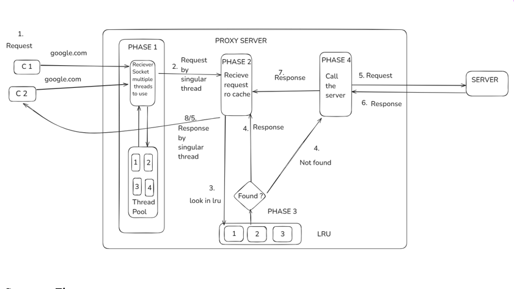

# 🔁 Multithreaded Proxy Server with LRU Caching

A high-performance, educational proxy web server in C that handles concurrent HTTP requests using multithreading and optimizes performance with an LRU (Least Recently Used) caching mechanism.

## 🎯 PROJECT GOALS & MILESTONES

Build a fully functional multithreaded HTTP proxy in C, with:
- Concurrent client handling via POSIX threads.
-  Efficient request forwarding and caching with an LRU policy.
-  Implement basic proxy server using sockets.
-  Support concurrent clients via threading.
-  Parse and forward HTTP GET requests.
-  Build LRU cache using a doubly linked list + hash map.
-  Ensure thread-safe access to shared cache via mutex/semaphores.
-  Handle large responses and dynamic content.
-  Add access logs and performance monitoring.
-  Make cache/thread count configurable via CLI or config file.

## SYSTEM ARCHITECTURE



### 🔧 Technologies Used

- **C Standard Libraries** — for memory management and low-level operations.
- **POSIX Threads (`pthread.h`)** — for multithreading and synchronization.
- **Sockets (`sys/socket.h`)** — for network communication.
- **Linux / Ubuntu (GCC)** — target platform with full POSIX and socket support.

### 🔄 Implementation Strategy

1. **Socket Server**  
   - A main socket listens on a port (e.g., 3490).  
   - Upon each client connection, a new thread is spawned.  
   - Threads use "connection sockets" to process each request independently.

2. **Multithreading**  
   - Each request is handled in parallel using `pthread_create`.  
   - Ensures responsiveness and scalability.

3. **LRU Cache**  
   - On each request, the cache is checked first.  
   - Cache uses LRU eviction: least-used data is removed when full.  
   - Implemented with a doubly linked list + hash table.

4. **Thread Safety**  
   - Shared cache access is synchronized using mutexes or read-write locks.  
   - Prevents data corruption and ensures consistent behavior.

5. **End-to-End Flow**

```text
Client → Proxy → Cache Check
       ↳ Cache Hit → Serve
       ↳ Cache Miss → Fetch from Server → Update Cache → Serve
```


## 📌 ASSUMPTIONS

- Runs on POSIX-compliant systems (e.g., Linux).
- All client requests are HTTP `GET` (not `POST`, `CONNECT`, etc.).
- Cache supports static files (HTML, CSS, etc.).
- DNS and network access are available.
- Designed for educational/demo use, not production.
- HTTPS (via `CONNECT`) is out of scope for this version.


## 🧪 TESTING

You can test the proxy using:

```bash
curl -x http://localhost:3490 http://example.com
```

Or by configuring your browser’s proxy settings to:
- Proxy server: `localhost`
- Port: `3490`
- Use only HTTP (not HTTPS)

